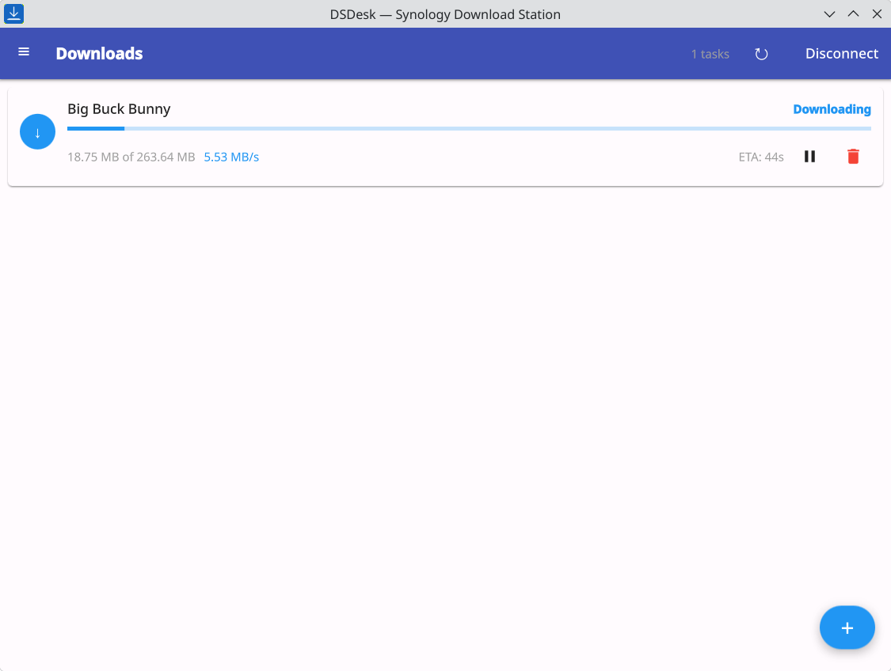

<p align="center">
  
</p>

<h1 align="center">DSDesk</h1>

<p align="center">A desktop client for <a href="https://www.synology.com/en-global/DSM/packages/DownloadStation">Synology Download Station</a>.</p>


## Table of Contents

- [Table of Contents](#table-of-contents)
- [Features](#features)
- [Screenshots](#screenshots)
- [Installation](#installation)
- [Building](#building)
  - [Prerequisites](#prerequisites)
  - [Build from source](#build-from-source)
  - [Run](#run)
- [Contributing](#contributing)
- [License](#license)
- [Author](#author)

## Features

- Browse and manage Download Station tasks from your desktop
- Add downloads via magnet urls or torrent files
- Monitor download progress in real-time
- Secure credential storage via system keychain
- Native look and feel with Qt Quick Controls

## Screenshots

<p align="center">
  
</p>

## Installation

Pre-built packages are available on the [Releases](https://github.com/dekomote/DSDesk/releases) page:

- **Fedora/openSUSE**: `.rpm`
- **Ubuntu/Debian**: `.deb`
- **Arch Linux**: `.pkg.tar.zst`
- **Flatpak**: `.flatpak`
- **AppImage**: `.AppImage` (portable, no installation needed)
- **Windows**: NSIS installer

## Building

### Prerequisites

- CMake 3.20+
- Qt 6.5 or later (Core, Gui, Network, Qml, Quick, QuickControls2)
- C++17 compatible compiler

### Build from source

```bash
cmake -S . -B build -DCMAKE_BUILD_TYPE=Release
cmake --build build --parallel
```

### Run

```bash
./build/dsdesk
```

## Contributing

Contributions are welcome! Please open an issue or pull request on [GitHub](https://github.com/dekomote/DSDesk).

## License

MIT License - see [LICENSE](LICENSE) for details.

## Author

Dejan Noveski - [GitHub](https://github.com/dekomote) - deko@duck.com
